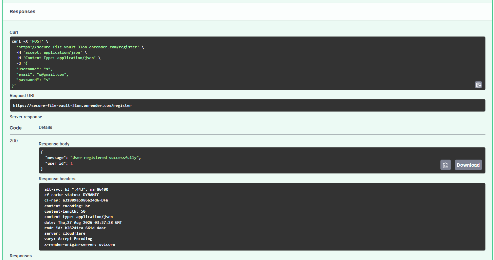
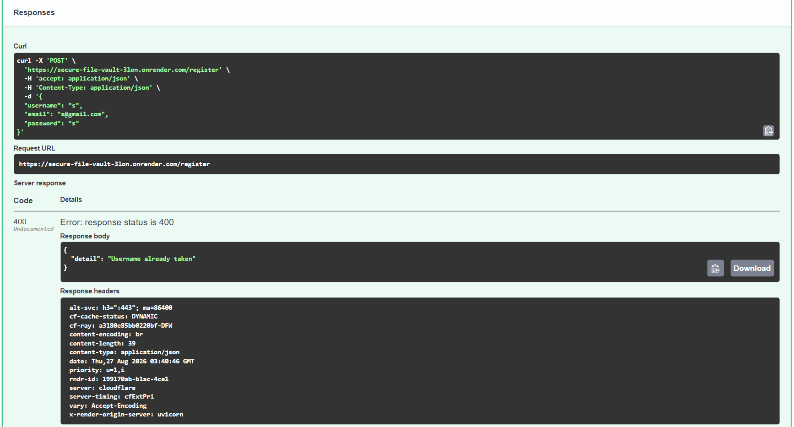
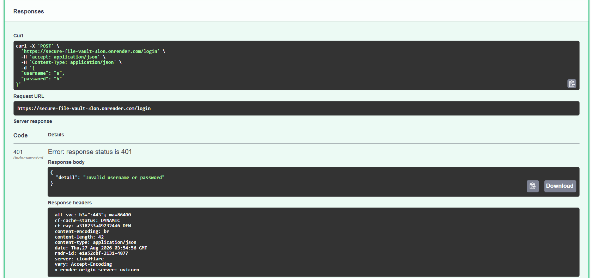
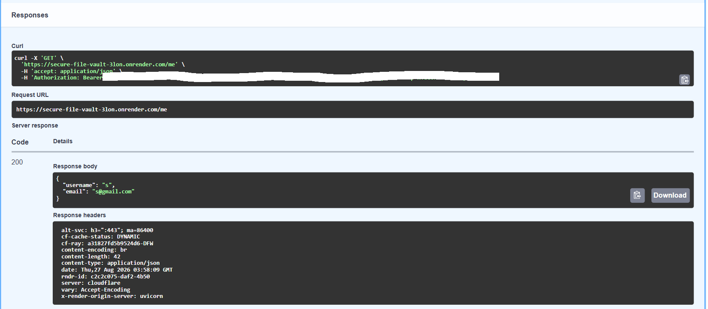
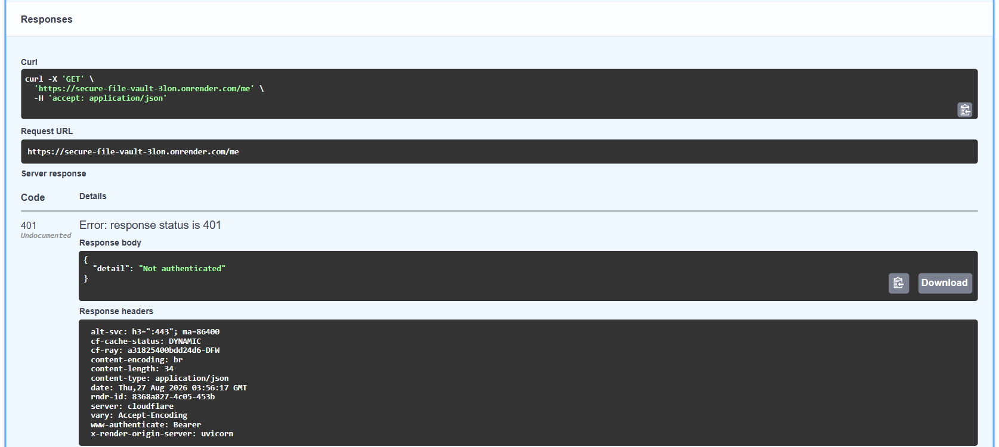
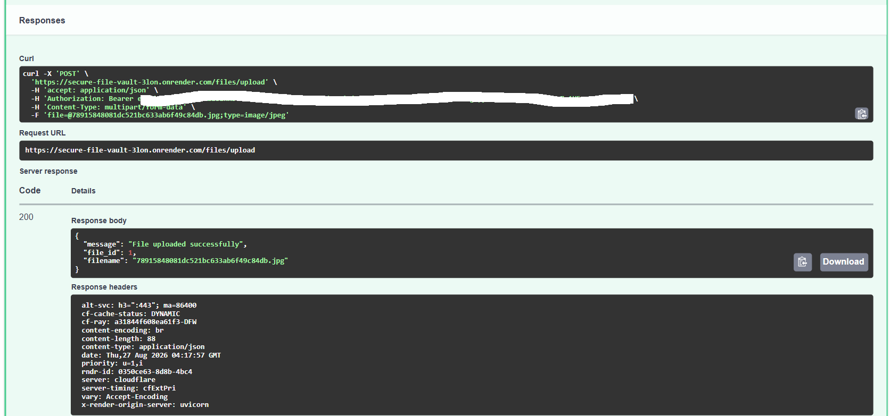
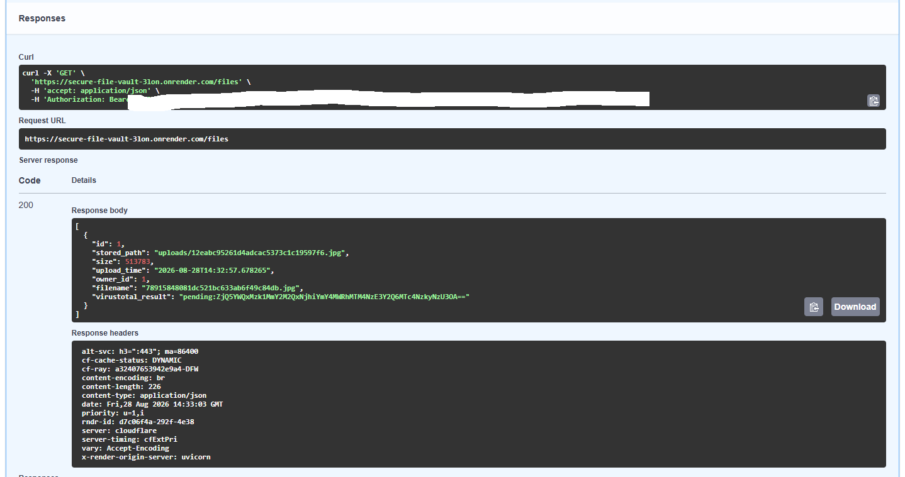
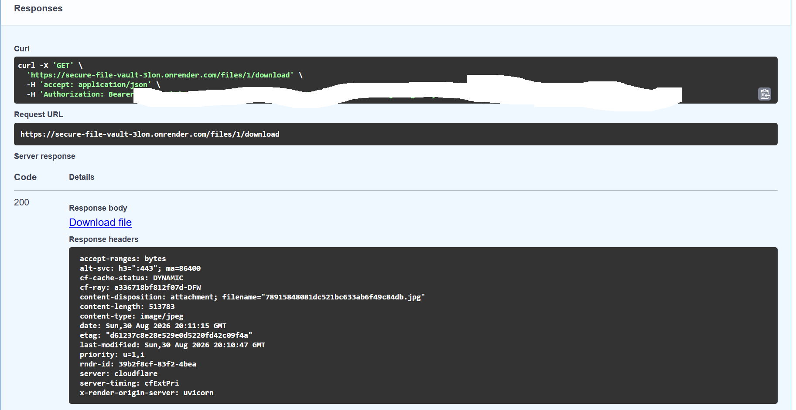
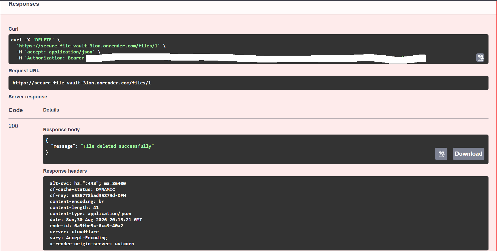
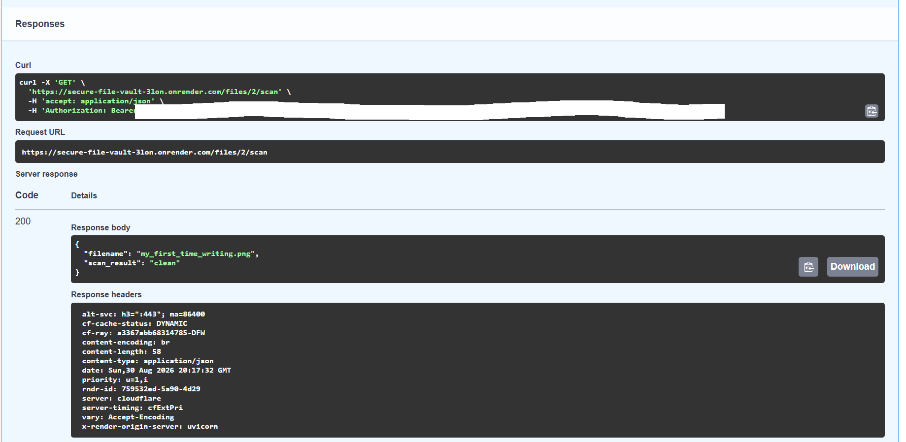

# Secure File Vault

A secure backend API for uploading, storing, and managing files, built with authentication, authorization, malware scanning, and full audit logging. Built as a hands-on project to learn backend development and apply practical security concepts.

## Why I Built This

I'm a CS student learning backend development and Python/FastAPI. Rather than following a generic CRUD tutorial, I wanted a project that forced me to implement real security concerns end-to-end: authentication, access control, input validation, malware scanning, and audit trails. This project allowed me to understand what it really takes to secure a backend application, from password hashing to audit trails.

## Live Demo

API base URL: https://secure-file-vault-3lon.onrender.com
Interactive API docs (Swagger UI): https://secure-file-vault-3lon.onrender.com/docs

> Note: hosted on Render's free tier, which sleeps after 15 minutes of inactivity (first request may take 30–60s to wake up) and has an ephemeral filesystem — uploaded files and the database reset periodically on redeploy/restart, so don't expect anything you upload on the live demo to persist long-term.

## Tech Stack

- **Language**: Python 3.12
- **Framework**: FastAPI
- **Server**: Uvicorn (ASGI)
- **Database**: SQLite with SQLModel (built on SQLAlchemy)
- **Auth**: JWT (python-jose), bcrypt password hashing (passlib)
- **Malware Scanning**: VirusTotal API
- **Hosting**: Render
- **Dev Environment**: WSL2 (Ubuntu), VS Code


## Features

**Authentication**
- User registration with bcrypt password hashing
- JWT-based login with 30-minute token expiration
- Protected routes requiring a valid token
- Logout endpoint (stateless via short-lived tokens)

**Authorization**
- Every file operation is scoped to the authenticated user
- Ownership checks on every file lookup (403 if you don't own it, 404 if it doesn't exist)

**File Management**
- Upload, download, delete, and list files
- File metadata (filename, size, upload time, owner, scan result) stored in SQLite

**Security Controls**
- Secrets (JWT signing key, API keys) stored in environment variables, never hardcoded
- File size limit (10MB) and dangerous file extension blocklist
- Filename sanitization to prevent path traversal
- Automatic malware scanning via the VirusTotal API on every upload
- Email format validation on registration
- SQL injection protection via SQLAlchemy/SQLModel's parameterized queries (no raw SQL anywhere)
- Consistent error handling with correct HTTP status codes throughout

**Audit Logging**
- Every login, logout, upload, download, and delete is logged with user, timestamp, IP address, and action

## Security Notes (OWASP-relevant defenses)

- **Broken Authentication**: passwords are hashed with bcrypt (never stored or compared in plaintext); JWTs are short-lived to limit the impact of a leaked token
- **Broken Access Control**: every file endpoint verifies the requester owns the resource before returning or modifying it, at the database query level
- **Injection**: all database access goes through an ORM (SQLModel/SQLAlchemy) with parameterized queries, reducing SQL injection risk
- **Unrestricted File Upload**: a dangerous-extension blocklist and 10MB size cap are enforced before any file is saved
- **Path Traversal**: filenames are sanitized and stored under generated identifiers rather than the original name
- **Malicious File Content**: every upload is submitted to VirusTotal for scanning
- **Security Misconfiguration**: secrets are never committed to source control (`.env` is gitignored; `.env.example` documents required variables without real values)
- **Insufficient Logging & Monitoring**: every sensitive action is recorded in an audit log with actor, action, timestamp, and IP


## Architecture Diagram

```text
                         Client / Swagger UI
                                │
                                │ HTTP requests
                                ▼
                         FastAPI Application
                                │
                 ┌──────────────┴──────────────┐
                 │                             │
                 ▼                             ▼
          Authentication                 File Endpoints
        register / login / me        upload / list / download
                 │                         / delete / scan
                 │                             │
          bcrypt + JWT                       │
                 │                    ownership validation
                 │                             │
                 └──────────────┬──────────────┘
                                │
                                ▼
                       SQLModel / SQLAlchemy
                                │
                ┌───────────────┼───────────────┐
                ▼               ▼               ▼
             Users            Files          Audit Logs
                │               │               │
                │               │               └─ user / action /
                │               │                  timestamp / IP
                │               ▼
                │        File Validation
                │        ├─ size limit
                │        ├─ extension check
                │        └─ filename sanitization
                │               │
                │               ├──────────────▶ VirusTotal API
                │               │                malware scan
                │               ▼
                │          Upload Storage
                │
                ▼
             SQLite
```

Secrets such as the JWT signing key and VirusTotal API key are loaded from environment variables rather than stored in source code. File operations require authentication and enforce ownership checks before accessing or modifying stored files.

## API Endpoints

| Method | Endpoint | Description | Auth required |
|---|---|---|---|
| POST | `/register` | Create a new user | No |
| POST | `/login` | Log in, receive a JWT | No |
| GET | `/me` | Get the current user's profile | Yes |
| POST | `/logout` | Log out (logs the action; discard token client-side) | Yes |
| POST | `/files/upload` | Upload a file | Yes |
| GET | `/files` | List the current user's files | Yes |
| GET | `/files/{file_id}/download` | Download a file you own | Yes |
| DELETE | `/files/{file_id}` | Delete a file you own | Yes |
| GET | `/files/{file_id}/scan` | Check a file's VirusTotal scan result | Yes |


## Screenshots

**Register — success and duplicate username**




**Login — success and failure**



**Authenticated request — `/me`**




**File upload — success and dangerous file rejected**




**List, download, and delete files**





**VirusTotal scan result**



*(Full request/response pairs for every scenario — including validation errors, 401s, and 404s — are in the `/screenshots` folder.)*

## Known Limitations

- **Duplicate email isn't handled gracefully:** Registration checks for a duplicate *username* but not a duplicate *email*, so registering with an already-used email throws an unhandled database error (500) instead of a clean 400.
- **No password strength requirement:** Any non-empty password is currently accepted at registration.
- **File validation:** Upload validation currently relies partially on file extensions and does not perform comprehensive content/MIME-type verification.
- **Local persistence:** SQLite and local file storage are appropriate for this demonstration but would need to be replaced with persistent database/object storage for production deployment.


## Running Locally

1. Clone the repo:
   ```
   git clone https://github.com/tejasvii1/secure-file-vault.git
   cd secure-file-vault
   ```

2. Create and activate a virtual environment:
   ```
   python3 -m venv venv
   source venv/bin/activate
   ```

3. Install dependencies:
   ```
   pip install -r requirements.txt
   ```

4. Create a `.env` file (see `.env.example` for the required variables) with your own `SECRET_KEY` and `VT_API_KEY`.

5. Run the server:
   ```
   uvicorn main:app --reload
   ```

6. Open `http://127.0.0.1:8000/docs` to test the API.

## API Testing

This project is backend-only with no frontend. All testing and demoing is done through the interactive Swagger UI at `/docs`, which lets you register, log in, authorize with your token, and try every endpoint directly in the browser.
